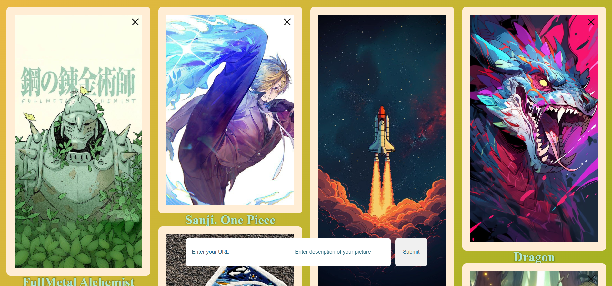
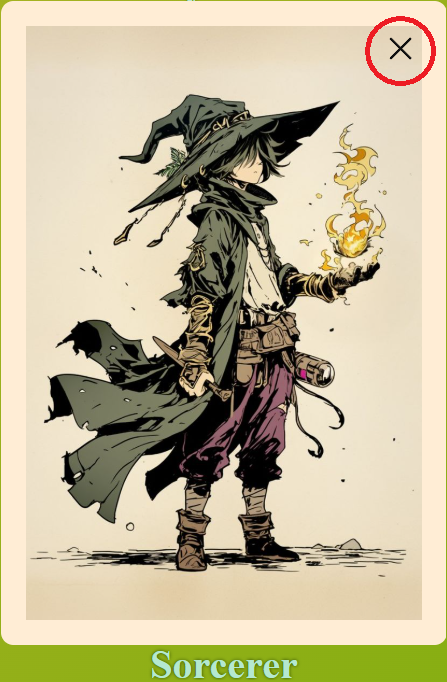
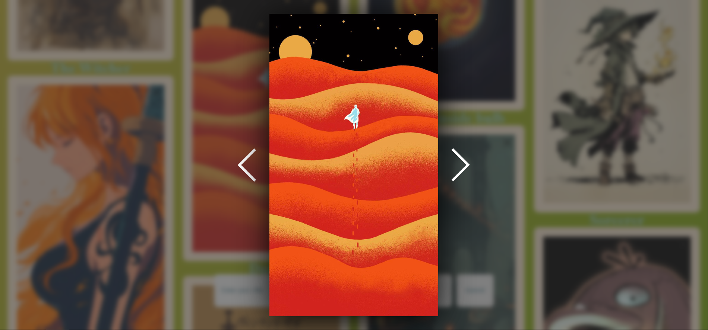

# This is a dynamic gallery created by me

## Built with
- Vanilla JS
- SCSS
- Webpack package
## Live Demo
[Dynamic Gallery Demo](https://bymajka.github.io/dynamic-gallery/)
## How works 
1. Clone this project: `git clone https://github.com/bymajka/dynamic-gallery.git`
2. Once you have cloned this project, you can install the required dependencies by using: `npm install`
3. After you can run prepared npm script: `npm run dev`
## Functions

### Adding images to page

### Removing images from page

### Lightbox and transitions between images

